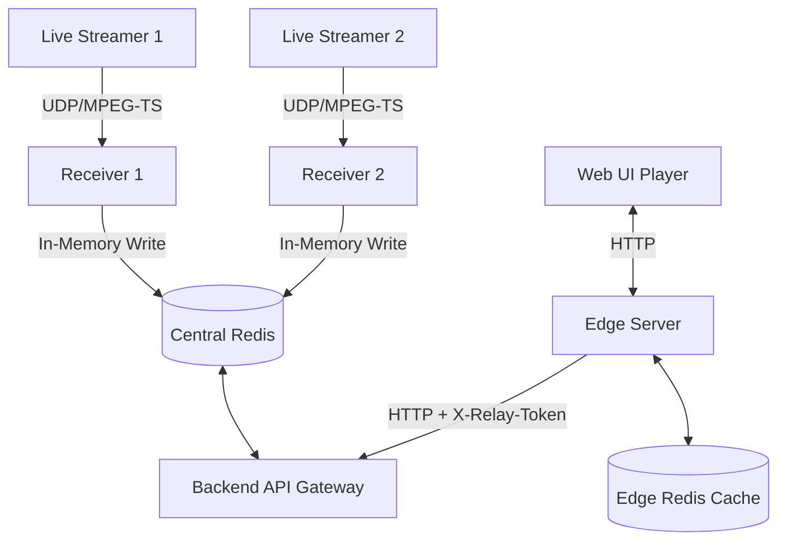

# Live Video Ingestion & Distribution Pipeline
### Air-Gapped CDN Emulation

A high-performance distributed live video streaming pipeline designed to emulate an air-gapped CDN architecture.

The system ingests live video streams, processes them in-memory with ultra-low latency, distributes them through authenticated edge relays, and serves HLS playback to browser clients using a multi-layer caching architecture.

---

# System Architecture



---

# Project Components

## 1. Stream Sources

### Technology
- FFmpeg
- Bash wrapper scripts

### Purpose
Simulates real-world live video feeds such as:
- IP cameras
- Satellite feeds
- External HLS sources

### Streams

#### Streamer 1
- Pulls a remote HLS manifest
- Re-muxes/transcodes into MPEG-TS
- Broadcasts continuously over UDP

#### Streamer 2
- Loops a local HD `.mp4` file
- Uses ultra-low latency FFmpeg settings
- Sends a stable MPEG-TS UDP stream

---

# 2. High-Speed Video Ingestion

### Technology
- Node.js
- TypeScript
- Native FFmpeg process spawning

### Features

## In-Memory HLS Processing

Instead of writing temporary video segments to disk, the receiver writes directly into Linux shared memory:

```bash
/dev/shm/hls_out
```

This dramatically reduces:
- Disk I/O
- Latency
- Filesystem overhead

---

## Event-Driven Segment Detection

The receiver listens reactively to FFmpeg stderr output.

Whenever FFmpeg reports:

```text
Opening 'segment.ts' for writing
```

the Node.js process immediately:
1. Reads the generated segment from shared memory
2. Loads it into RAM
3. Pushes it into Redis

---

## Centralized Storage

The following assets are stored inside Redis:
- `.m3u8` playlists
- `.ts` media segments

### Expiration Policy

```text
TTL: 600 seconds
```

All content uses sliding expiration to ensure automatic cleanup and bounded memory usage.

---

# 3. Backend API Gateway

### Technology
- Express.js
- TypeScript
- ioredis

### Responsibilities
- Serves as the authoritative ingestion gateway
- Exposes HLS playlists and media chunks
- Abstracts Redis access behind HTTP APIs
- Handles proper content-type delivery

### Supported Content Types

| File Type | Content-Type |
|---|---|
| `.m3u8` | `application/x-mpegURL` |
| `.ts` | `video/MP2T` |

---

# 4. Edge Distribution Relay

### Technology
- Express.js
- Axios
- ioredis
- TypeScript

The edge server emulates a CDN edge node located at a remote site.

---

## Edge Cache Workflow

### Cache Hit
If the requested segment exists locally:
- Returned immediately from edge Redis
- No upstream traffic generated

### Cache Miss
The edge server:
1. Authenticates with the central API
2. Downloads the resource
3. Serves the client
4. Stores the segment locally for short-term reuse

---

## Edge Cache Policy

```text
TTL: 10 seconds
```

This minimizes:
- Backhaul bandwidth
- Origin API pressure
- Segment duplication requests

---

# 5. Web Client

### Technology
- React
- TypeScript
- Vite
- HLS.js

### Features
- Dynamic stream discovery
- Browser-native HLS playback
- Real-time playback buffering
- Administrative stream dashboard

---

# Security Model

The project follows a strict zero-trust internal network architecture.

---

## Inter-Service Authentication

All edge-to-origin requests must include:

```http
X-Relay-Token
```

The backend validates the token against:

```env
INTERNAL_AUTH_TOKEN
```

Unauthorized requests are rejected immediately.

---

## Fail-Closed Design

If authentication configuration is missing or invalid:
- Requests fail automatically
- No insecure fallback behavior exists

---

## Infrastructure Isolation

Production deployments avoid host-mounted media directories.

Video data remains isolated within:
- Containerized services
- Internal Docker networks
- Shared memory boundaries

---

## Health Check Exemptions

Health endpoints remain publicly accessible:

```text
/health
```

This allows:
- Docker health probes
- Orchestrators
- Monitoring systems

to validate service availability without requiring internal secrets.

---

# Core Technologies

| Layer | Technology |
|---|---|
| Video Processing | FFmpeg |
| Backend API | Express.js |
| Edge Proxy | Express.js + Axios |
| Streaming Cache | Redis |
| Frontend | React + Vite |
| Runtime | Node.js |
| Language | TypeScript |
| Playback | HLS.js |

---

# Key Features

- Ultra-low latency ingestion
- In-memory HLS generation
- Distributed edge caching
- Redis-based transient storage
- Zero-trust relay authentication
- Air-gapped CDN emulation
- Fully containerized architecture
- Real-time browser playback

---

# Deployment

Start the entire stack:

```bash
docker compose up --build
```

Run in detached mode:

```bash
docker compose up -d --build
```